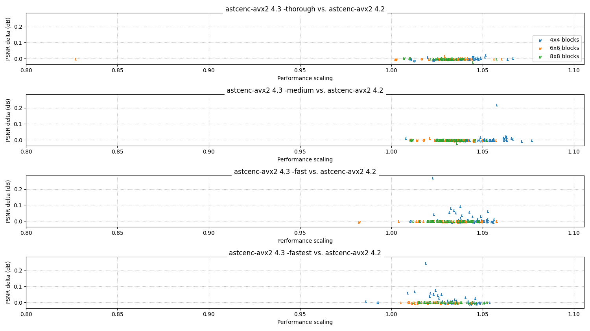
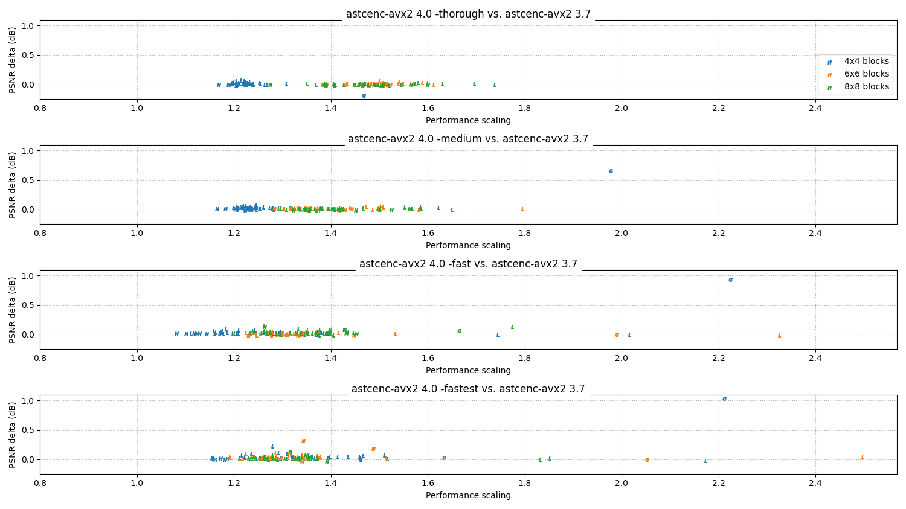

# 4.x series change log

This page summarizes the major functional and performance changes in each
release of the 4.x series.

All performance data on this page is measured on an Intel Core i5-9600K
clocked at 4.2 GHz, running `astcenc` using AVX2 and 6 threads.

<!-- ---------------------------------------------------------------------- -->
## 4.3.0

**Status:** January 2023

The 4.3.0 release is an optimization release. There are minor performance
and image quality improvements in this release.

Reminder - the codec library API is not designed to be binary compatible across
versions. We always recommend rebuilding your client-side code using the updated
`astcenc.h` header.

* **General:**
  * **Bug-fix:** Use lower case `windows.h` include for MinGW compatibility.
  * **Change:** The `-mask` command line option, `ASTCENC_FLG_MAP_MASK` in the
    library API, has been removed.
  * **Optimization:** Always skip blue-contraction for `QUANT_256` encodings.
    This gives a small image quality improvement for the 4x4 block size.
  * **Optimization:** Always skip RGBO vector calculation for LDR encodings.
  * **Optimization:** Defer color packing and scrambling to physical layer.
  * **Optimization:** Remove folded `decimation_info` lookup tables. This
    significantly reduces compressor memory footprint and improves context
    creation time. Impact increases with the active block size.
  * **Optimization:** Increased trial and refinement pruning by using stricter
    target errors when determining whether to skip iterations.

### Performance:

Key for charts:

* Color = block size (see legend).
* Letter = image format (N = normal map, G = grayscale, L = LDR, H = HDR).

**Relative performance vs 4.2 release:**

<!-- ---------------------------------------------------------------------- -->
## 4.2.0

**Status:** November 2022

The 4.2.0 release is an optimization release. There are significant performance
improvements, minor image quality improvements, and library interface changes in
this release.

Reminder - the codec library API is not designed to be binary compatible across
versions. We always recommend rebuilding your client-side code using the updated
`astcenc.h` header.

* **General:**
  * **Bug-fix:** Compression for RGB and RGBA base+offset encodings no
    longer generate endpoints with the incorrect blue-contract behavior.
  * **Bug-fix:** Lowest channel correlation calculation now correctly ignores
    constant color channels for the purposes of filtering 2 plane encodings.
    On average this improves both performance and image quality.
  * **Bug-fix:** ISA compatibility now checked in `config_init()` as well as
    in `context_alloc()`.
  * **Change:** Removed the low-weight count optimization, as more recent
    changes had significantly reduced its performance benefit. Option removed
    from both command line and configuration structure.
  * **Feature:** The `-exhaustive` mode now runs full trials on more
    partitioning candidates and block candidates. This improves image quality
    by 0.1 to 0.25 dB, but slows down compression by 3x. The `-verythorough`
    and `-thorough` modes also test more candidates.
  * **Feature:** A new preset, `-verythorough`, has been introduced to provide
    a standard performance point between `-thorough` and the re-tuned
    `-exhaustive` mode. This new mode is faster and higher quality than the
    `-exhaustive` preset in the 4.1 release.
  * **Feature:** The compressor can now independently vary the number of
    partitionings considered for error estimation for 2/3/4 partitions. This
    allows heuristics to put more effort into 2 partitions, and less in to
    3/4 partitions.
  * **Feature:** The compressor can now run trials on a variable number of
    candidate partitionings, allowing high quality modes to explore more of the
    search space at the expense of slower compression. The number of trials is
    independently configurable for 2/3/4 partition cases.
  * **Optimization:** Introduce early-out threshold for 2/3/4 partition
    searches based on the results after 1 of 2 trials. This significantly
    improves performance for `-medium` and `-thorough` searches, for a minor
    loss in image quality.
  * **Optimization:** Reduce early-out threshold for 3/4 partition searches
    based on 2/3 partition results. This significantly improves performance,
    especially for `-thorough` searches, for a minor loss in image quality.
  * **Optimization:** Use direct vector compare to create a SIMD mask instead
    of a scalar compare that is broadcast to a vector mask.
  * **Optimization:** Remove obsolete partition validity masks from the
    partition selection algorithm.
  * **Optimization:** Removed obsolete channel scaling from partition
    `avgs_and_dirs()` calculation.

### Performance:

Key for charts:

* Color = block size (see legend).
* Letter = image format (N = normal map, G = grayscale, L = LDR, H = HDR).

**Relative performance vs 4.0 and 4.1 release:**

<!-- ---------------------------------------------------------------------- -->
## 4.1.0

**Status:** August 2022

The 4.1.0 release is a maintenance release. There is no performance or image
quality change in this release.

* **General:**
  * **Change:** Command line decompressor no longer uses the legacy
    `GL_LUMINANCE` or `GL_LUMINANCE_ALPHA` format enums when writing KTX
    output files. Luminance textures now use the `GL_RED` format and
    luminance_alpha textures now use the `GL_RG` format.
  * **Change:** Command line tool gains a new `-dimage` option to generate
    diagnostic images showing aspects of the compression encoding. The output
    file name with its extension stripped is used as the stem of the diagnostic
    image file names.
  * **Bug-fix:** Library decompressor builds for SSE no longer use masked store
    `maskmovdqu` instructions, as they can generate faults on masked lanes.
  * **Bug-fix:** Command line decompressor now correctly uses sized type enums
    for the internal format when writing output KTX files.
  * **Bug-fix:** Command line compressor now correctly loads 16 and 32-bit per
    component input KTX files.
  * **Bug-fix:** Fixed GCC9 compiler warnings on Arm aarch64.

<!-- ---------------------------------------------------------------------- -->
## 4.0.0

**Status:** July 2022

The 4.0.0 release introduces some major performance enhancement, and a number
of larger changes to the heuristics used in the codec to find a more effective
cost:quality trade off.

* **General:**
  * **Change:** The `-array` option for specifying the number of image planes
    for ASTC 3D volumetric block compression been renamed to `-zdim`.
  * **Change:** The build root package directory is now `bin` instead of
    `astcenc`, allowing the CMake install step to write binaries into
    `/usr/local/bin` if the user wishes to do so.
  * **Feature:** A new `-ssw` option for specifying the shader sampling swizzle
    has been added as convenience alternative to the `-cw` option. This is
    needed to correct error weighting during compression if not all components
    are read in the shader. For example, to extract and compress two components
    from an RGBA input image, weighting the two components equally when
    sampling through .ra in the shader, use `-esw ggga -ssw ra`. In this
    example `-ssw ra` is equivalent to the alternative `-cw 1 0 0 1` encoding.
  * **Feature:** The `-a` alpha weighting option has been re-enabled in the
    backend, and now again applies alpha scaling to the RGB error metrics when
    encoding. This is based on the maximum alpha in each block, not the
    individual texel alpha values used in the earlier implementation.
  * **Feature:** The command line tool now has `-repeats <count>` for testing,
    which will iterate around compression and decompression `count` times.
    Reported performance metrics also now separate compression and
    decompression scores.
  * **Feature:** The core codec is now warning clean up to /W4 for both MSVC
    `cl.exe` and `clangcl.exe` compilers.
  * **Feature:** The core codec now supports arm64 for both MSVC `cl.exe` and
    `clangcl.exe` compilers.
  * **Feature:** `NO_INVARIANCE` builds will enable the `-ffp-contract=fast`
    option for all targets when using Clang or GCC. In addition AVX2 targets
    will also set the `-mfma` option. This reduces image quality by up to 0.2dB
    (normally much less), but improves performance by up to 5-20%.
  * **Optimization:** Angular endpoint min/max weight selection is restricted
    to weight `QUANT_11` or lower. Higher quantization levels assume default
    0-1 range, which is less accurate but much faster.
  * **Optimization:** Maximum weight quantization for later trials is selected
    based on the weight quantization of the best encoding from the 1 plane 1
    partition trial. This significantly reduces the search space for the later
    trials with more planes or partitions.
  * **Optimization:** Small data tables now use in-register SIMD permutes
    rather than gathers (AVX2) or unrolled scalar lookups (SSE/NEON). This can
    be a significant optimization for paths that are load unit limited.
  * **Optimization:** Decompressed image block writes in the decompressor now
    use a vectorized approach to writing each row of texels in the block,
    including to ability to exploit masked stores if the target supports them.
  * **Optimization:** Weight scrambling has been moved into the physical layer;
    the rest of the codec now uses linear order weights.
  * **Optimization:** Weight packing has been moved into the physical layer;
    the rest of the codec now uses unpacked weights in the 0-64 range.
  * **Optimization:** Consistently vectorize the creation of unquantized weight
    grids when they are needed.
  * **Optimization:** Remove redundant per-decimation mode copies of endpoint
    and weight structures, which were really read-only duplicates.
  * **Optimization:** Early-out the same endpoint mode color calculation if it
    cannot be applied.
  * **Optimization:** Numerous type size reductions applied to arrays to reduce
    both context working buffer size usage and stack usage.

### Performance:

Key for charts:

* Color = block size (see legend).
* Letter = image format (N = normal map, G = grayscale, L = LDR, H = HDR).

**Relative performance vs 3.7 release:**

- - -

_Copyright © 2022-2023, Arm Limited and contributors. All rights reserved._
